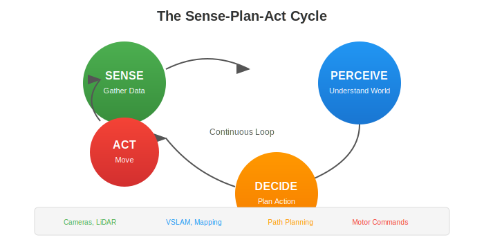
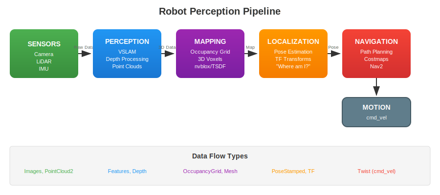
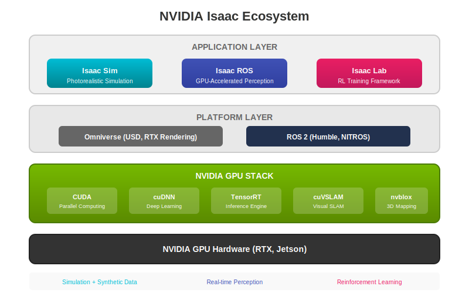

# Chapter 1: Introduction to Robot Perception

**Estimated Time**: 45 minutes reading + 30 minutes exercises

## Learning Objectives

By the end of this chapter, you will be able to:

1. Define robot perception and explain its role in autonomous systems
2. Identify and describe the 5 core perception pipelines (VSLAM, depth, mapping, localization, navigation)
3. Explain the NVIDIA Isaac ecosystem and how its components relate
4. Trace data flow from sensors through perception to navigation

## Prerequisites

- Completed Module 1: ROS 2 Fundamentals
- Completed Module 2: Digital Twin Simulation
- Understanding of coordinate frames and transforms
- Basic familiarity with camera/LiDAR sensors

---

## 1.1 What is Robot Perception?

**Robot perception** is the ability of a robot to use sensor data to understand its environment and its position within that environment. Just as humans use their senses to navigate the world, robots use cameras, LiDAR, and other sensors to "see" and make decisions.

### The Sense-Plan-Act Cycle

Every autonomous robot operates in a continuous loop:



1. **Sense**: Gather raw data from sensors (cameras, LiDAR, IMU)
2. **Perceive**: Process that data to understand the environment
3. **Decide**: Plan what action to take based on understanding
4. **Act**: Execute the planned action (move, grasp, etc.)

This cycle repeats continuously, allowing robots to react to changes in their environment in real-time.

### Why Perception is the Foundation of Autonomy

Without perception, a robot is blind. Consider these scenarios:

| Without Perception | With Perception |
|-------------------|-----------------|
| Robot crashes into obstacles | Robot detects and avoids obstacles |
| Robot gets lost in new environments | Robot builds maps and localizes itself |
| Robot cannot find objects | Robot identifies and locates objects |
| Robot cannot plan paths | Robot navigates efficiently to goals |

Perception transforms raw sensor data into **actionable information** that enables autonomous behavior.

---

## 1.2 The Five Core Perception Pipelines

Modern robots use multiple perception pipelines working together. Let's explore each one:



### 1. VSLAM (Visual Simultaneous Localization and Mapping)

**VSLAM** answers two questions simultaneously:
- **Where am I?** (Localization)
- **What does the world look like?** (Mapping)

```
Camera Images → Feature Detection → Feature Matching →
Pose Estimation → Map Update → Loop Closure
```

**Key concepts:**
- **Features**: Distinctive points in images (corners, edges)
- **Pose**: The robot's position and orientation (6 degrees of freedom)
- **Loop closure**: Recognizing previously visited locations to correct drift

**Why it matters**: VSLAM allows robots to navigate in GPS-denied environments (indoors, underground) using only cameras.

### 2. Depth Processing

**Depth processing** converts 2D images into 3D understanding:

```
Stereo Images → Disparity Calculation → Depth Map → Point Cloud
```

**Methods:**
- **Stereo vision**: Two cameras, like human eyes
- **Structured light**: Projecting patterns (e.g., Intel RealSense)
- **Time-of-Flight (ToF)**: Measuring light travel time

**Output**: Point clouds (collections of 3D points) or depth images.

### 3. Mapping

**Mapping** builds representations of the environment:

| Map Type | Description | Use Case |
|----------|-------------|----------|
| Occupancy Grid | 2D grid: occupied/free/unknown | 2D navigation |
| 3D Voxels | 3D cubes in space | Drone navigation |
| TSDF (Truncated Signed Distance Field) | Distance to nearest surface | 3D reconstruction |
| ESDF (Euclidean Signed Distance Field) | Exact distance fields | Path planning |

**nvblox** (used in Isaac ROS) creates real-time 3D maps using GPU acceleration.

### 4. Localization

**Localization** determines the robot's pose within a known map:

```
Current Sensor Data + Prior Map → Particle Filter/EKF → Pose Estimate
```

**Key algorithms:**
- **AMCL** (Adaptive Monte Carlo Localization): Particle filter for 2D
- **Pose graph optimization**: Corrects accumulated drift
- **Sensor fusion**: Combining IMU, odometry, and visual data

### 5. Navigation

**Navigation** plans and executes motion to goals:

```
Current Pose + Goal + Map → Path Planning →
Motion Control → Velocity Commands
```

**Components:**
- **Global planner**: Plans overall path (A*, Dijkstra, RRT)
- **Local planner**: Avoids obstacles in real-time
- **Costmaps**: Represent traversability costs
- **Recovery behaviors**: Handle stuck situations

---

## 1.3 Depth Cameras vs LiDAR

Choosing the right sensor depends on your application:

| Feature | Depth Camera | LiDAR |
|---------|--------------|-------|
| **Range** | 0.1-10m | 0.5-200m |
| **Resolution** | High (VGA-4K) | Medium (16-128 lines) |
| **Field of View** | 60-90° | 360° (scanning) |
| **Outdoor Performance** | Poor (sunlight issues) | Excellent |
| **Cost** | $200-500 | $500-10,000+ |
| **Data Rate** | 30-90 fps | 10-20 Hz |
| **RGB Data** | Yes (RGB-D cameras) | No |

### When to Use Each

**Use Depth Cameras when:**
- Operating indoors
- Need RGB + depth together
- Budget is limited
- High resolution required

**Use LiDAR when:**
- Operating outdoors
- Need long range
- 360° coverage required
- High accuracy critical

**Common combinations:**
- **Indoor robots**: RGB-D camera (RealSense D455)
- **Autonomous vehicles**: Multi-LiDAR + cameras
- **Humanoid robots**: Stereo cameras + IMU

---

## 1.4 The NVIDIA Isaac Ecosystem

NVIDIA provides a comprehensive ecosystem for robot perception and AI:



### Isaac Sim

**Purpose**: Photorealistic simulation and synthetic data generation

**Key features:**
- Physics-accurate robot simulation
- Synthetic dataset generation with ground truth
- Domain randomization for ML training
- ROS 2 bridge for seamless integration

**Use cases:**
- Training perception models
- Testing navigation algorithms
- Generating labeled training data

### Isaac ROS

**Purpose**: GPU-accelerated perception for ROS 2

**Key packages:**
- `isaac_ros_visual_slam`: GPU-accelerated VSLAM (cuVSLAM)
- `isaac_ros_depth_image_proc`: Fast depth processing
- `isaac_ros_nvblox`: Real-time 3D mapping

**Why GPU acceleration?**

| Operation | CPU Time | GPU Time | Speedup |
|-----------|----------|----------|---------|
| Stereo depth | 50ms | 5ms | 10x |
| VSLAM | 30ms | 3ms | 10x |
| Point cloud | 20ms | 2ms | 10x |

### Isaac Lab (formerly Isaac Gym)

**Purpose**: Reinforcement learning for robotics

**Key features:**
- Massively parallel simulation
- GPU-accelerated physics
- End-to-end RL training

### How They Connect

```
Isaac Sim (Training) → Isaac ROS (Deployment) → Robot Hardware
      ↑                       ↓
Synthetic Data        Real-time Perception
```

---

## 1.5 From Sensors to Navigation

Let's trace how data flows through a complete perception system.

### Topic Names and Message Types

In ROS 2, perception data flows through topics:

```bash
# Common sensor topics
/camera/color/image_raw      # sensor_msgs/Image
/camera/depth/image_rect_raw # sensor_msgs/Image
/camera/depth/points         # sensor_msgs/PointCloud2
/scan                        # sensor_msgs/LaserScan
/imu/data                    # sensor_msgs/Imu

# Perception outputs
/visual_slam/tracking/odometry  # nav_msgs/Odometry
/nvblox_node/mesh               # nvblox_msgs/Mesh
/map                            # nav_msgs/OccupancyGrid

# Navigation topics
/goal_pose                   # geometry_msgs/PoseStamped
/cmd_vel                     # geometry_msgs/Twist
```

### Visualizing the Pipeline

Use RViz2 to visualize perception data:

```bash
# Launch RViz2 with common displays
ros2 run rviz2 rviz2

# List all active topics
ros2 topic list

# Echo a topic to see data
ros2 topic echo /camera/depth/points --once

# Check topic frequency
ros2 topic hz /camera/color/image_raw
```

### Example: Tracing Depth Data

```
Camera → /camera/depth/image_raw → isaac_ros_depth_image_proc →
/depth/points → nvblox → /nvblox_node/static_map → Nav2 costmap
```

Each step transforms the data:
1. **Camera**: Raw depth image (640x480 uint16)
2. **Depth proc**: Point cloud (307,200 points)
3. **nvblox**: Voxel map (0.05m resolution)
4. **Nav2**: Costmap (obstacle inflation)

---

## 1.6 Why GPU Acceleration Matters

### The Real-Time Challenge

Autonomous robots must process sensor data **in real-time**:

| Task | Deadline | Without GPU | With GPU |
|------|----------|-------------|----------|
| Obstacle detection | 50ms | 80ms ❌ | 8ms ✓ |
| VSLAM | 33ms (30fps) | 45ms ❌ | 5ms ✓ |
| Path planning | 100ms | 150ms ❌ | 20ms ✓ |

Missing deadlines means:
- Delayed obstacle avoidance → collisions
- Dropped frames → tracking loss
- Slow replanning → jerky motion

### When GPU Acceleration is Essential

**Essential for:**
- Real-time VSLAM (especially with high-resolution cameras)
- Dense depth processing (stereo matching, point clouds)
- 3D mapping (nvblox, TSDF reconstruction)
- Multi-sensor fusion
- Neural network inference

**Not necessary for:**
- Simple 2D LiDAR processing
- Low-frequency planning (< 1 Hz)
- Basic localization (AMCL)
- Single-camera feature tracking

### Isaac ROS Performance

NVIDIA Isaac ROS achieves significant speedups:

```
┌─────────────────────────────────────────────────────────────┐
│               Processing Time Comparison                     │
├────────────────────┬──────────────┬──────────────┬──────────┤
│ Algorithm          │ CPU (ms)     │ GPU (ms)     │ Speedup  │
├────────────────────┼──────────────┼──────────────┼──────────┤
│ cuVSLAM            │ 28.5         │ 2.8          │ 10.2x    │
│ Depth to Point     │ 15.2         │ 1.5          │ 10.1x    │
│ nvblox mapping     │ 45.0         │ 8.0          │ 5.6x     │
│ DNN Inference      │ 120.0        │ 12.0         │ 10.0x    │
└────────────────────┴──────────────┴──────────────┴──────────┘
```

---

## Exercises

### Exercise 1.1: Draw the Pipeline (15 min)

**Objective**: Reinforce understanding of perception stages

**Task**: On paper or whiteboard, draw the perception pipeline from camera to navigation command. Include:
- All 5 stages (Sensors → Perception → Mapping → Localization → Navigation)
- Data types at each transition
- ROS topic names where possible

**Success Criteria**:
- [ ] Diagram includes all 5 stages
- [ ] Correct data types at each transition (Image, PointCloud2, OccupancyGrid, Pose, Twist)
- [ ] Arrows show data flow direction

### Exercise 1.2: Sensor Selection (15 min)

**Objective**: Apply sensor knowledge to real scenarios

**Task**: For each scenario, recommend the appropriate sensor(s) with justification:

1. **Indoor service robot** (restaurant, hotel)
   - Environment: Structured, well-lit, dynamic people
   - Budget: Moderate
   - Your recommendation: _____________
   - Justification: _____________

2. **Outdoor delivery robot** (sidewalk, campus)
   - Environment: Sun, rain, uneven terrain
   - Budget: Higher
   - Your recommendation: _____________
   - Justification: _____________

3. **Underwater inspection robot** (pipeline, ship hull)
   - Environment: Dark, murky water, no GPS
   - Budget: High
   - Your recommendation: _____________
   - Justification: _____________

**Success Criteria**:
- [ ] Reasonable sensor choice for each scenario
- [ ] At least 3 considerations mentioned per scenario
- [ ] Trade-offs acknowledged

---

## Assessment Questions

### Multiple Choice

**1.** Which perception pipeline is responsible for creating a map while simultaneously tracking the robot's position?

- A) Depth Processing
- B) VSLAM
- C) Navigation
- D) Localization

<details>
<summary>Answer</summary>
**B) VSLAM** - Visual Simultaneous Localization and Mapping solves both problems together.
</details>

**2.** In the NVIDIA Isaac ecosystem, which component provides GPU-accelerated ROS 2 perception nodes?

- A) Isaac Sim
- B) Isaac SDK
- C) Isaac ROS
- D) Omniverse

<details>
<summary>Answer</summary>
**C) Isaac ROS** - It provides GPU-accelerated perception packages like cuVSLAM and nvblox.
</details>

### Short Answer

**3.** Explain two advantages and two disadvantages of LiDAR compared to RGB-D cameras for perception.

<details>
<summary>Answer</summary>
**Advantages:**
- Works outdoors in sunlight (not affected by ambient light)
- Longer range (up to 200m vs 10m)
- 360° field of view (scanning LiDARs)

**Disadvantages:**
- Higher cost ($500-10,000+ vs $200-500)
- No color/texture information
- Lower angular resolution
</details>

**4.** Why is GPU acceleration important for real-time robot perception? Give a specific example.

<details>
<summary>Answer</summary>
GPU acceleration is important because perception tasks must complete within strict deadlines for safe robot operation.

**Example**: VSLAM must process frames at 30fps (33ms deadline). CPU-based VSLAM takes ~45ms per frame, causing dropped frames and tracking loss. GPU-accelerated cuVSLAM completes in ~5ms, ensuring real-time performance with margin for other tasks.
</details>

### Diagram

**5.** Label the five stages of the perception pipeline diagram, including the data type at each stage.

<details>
<summary>Answer</summary>
1. **Sensors** → Image, PointCloud2, LaserScan
2. **Perception** → Features, Depth maps
3. **Mapping** → OccupancyGrid, Mesh, TSDF
4. **Localization** → PoseStamped, Odometry
5. **Navigation** → Path, Twist (cmd_vel)
</details>

---

## Summary

In this chapter, you learned:

- **Robot perception** is the foundation of autonomous behavior
- The **sense-plan-act cycle** drives all robot decision-making
- **Five core pipelines** work together: VSLAM, Depth, Mapping, Localization, Navigation
- **Depth cameras** are ideal for indoor, short-range applications
- **LiDAR** excels outdoors and at long range
- **NVIDIA Isaac** provides simulation (Isaac Sim), perception (Isaac ROS), and training (Isaac Lab)
- **GPU acceleration** is essential for real-time perception performance

---

## References

1. NVIDIA. (2024). *Isaac ROS Overview*. https://nvidia-isaac-ros.github.io/
2. Cadena, C., et al. (2016). "Past, Present, and Future of Simultaneous Localization and Mapping." *IEEE Transactions on Robotics*, 32(6), 1309-1332.
3. Thrun, S. (2002). "Robotic Mapping: A Survey." In *Exploring Artificial Intelligence in the New Millennium* (pp. 1-35). Morgan Kaufmann.
4. Open Robotics. (2024). *ROS 2 Humble Documentation*. https://docs.ros.org/en/humble/

---

**Next**: [Chapter 2: Isaac Sim for Synthetic Data](./chapter-02-isaac-sim) →
