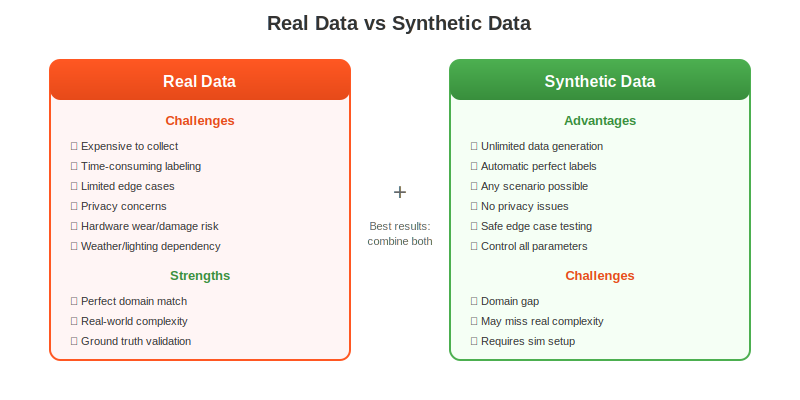
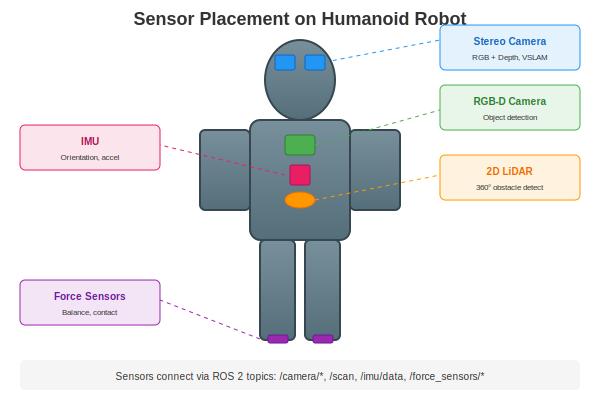
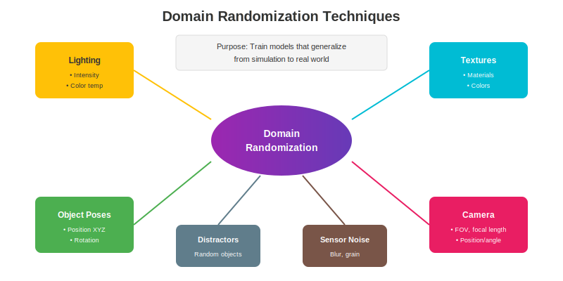
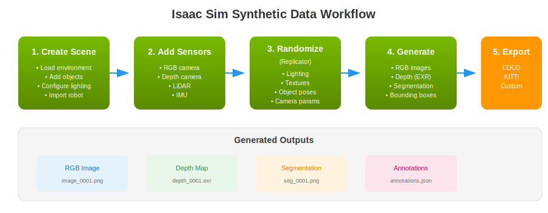

# Chapter 2: Isaac Sim for Synthetic Data

**Estimated Time**: 60 minutes reading + 45 minutes exercises

## Learning Objectives

By the end of this chapter, you will be able to:

1. Install and launch NVIDIA Isaac Sim
2. Create a basic photorealistic indoor environment
3. Configure sensors (camera, LiDAR) on a robot model
4. Apply Domain Randomization for training data diversity
5. Export synthetic datasets in COCO format

## Prerequisites

- Completed Chapter 1: Introduction to Robot Perception
- NVIDIA GPU with 8GB+ VRAM
- Ubuntu 22.04 or Windows 10/11
- Basic Python programming

---

## 2.1 Why Synthetic Data?

Training perception models requires massive amounts of labeled data. Collecting and labeling real-world data is expensive, time-consuming, and limited in scope. Synthetic data offers a powerful alternative.

### The Data Problem in Robotics ML

Consider training an object detection model for a robot:

| Real Data Challenge | Impact |
|---------------------|--------|
| Collection costs | $10-100+ per labeled image |
| Time to label | 30-60 seconds per image |
| Edge case coverage | Rare events are... rare |
| Privacy concerns | Can't capture everywhere |
| Safety limitations | Can't create dangerous scenarios |

### Synthetic Data Advantages



**Key benefits:**
- **Unlimited scale**: Generate millions of images overnight
- **Perfect labels**: Annotations are automatic and exact
- **Complete control**: Create any scenario, including edge cases
- **Safety**: Test failure modes without risk
- **Privacy**: No real people or places required

### The Domain Gap Challenge

The main challenge with synthetic data is the **domain gap** - the difference between simulated and real-world data. Models trained only on synthetic data may not perform well on real images.

**Solutions:**
1. **Photorealistic rendering**: Isaac Sim uses RTX ray tracing
2. **Domain randomization**: Vary textures, lighting, poses
3. **Mixed training**: Combine synthetic + real data
4. **Fine-tuning**: Pretrain on synthetic, fine-tune on real

---

## 2.2 Isaac Sim Installation and Setup

### System Requirements

| Component | Minimum | Recommended |
|-----------|---------|-------------|
| **GPU** | RTX 2070 | RTX 3080+ |
| **VRAM** | 8 GB | 16 GB |
| **RAM** | 32 GB | 64 GB |
| **Storage** | 50 GB SSD | 100 GB NVMe |
| **OS** | Ubuntu 20.04/22.04 | Ubuntu 22.04 |
| **Driver** | 525.60+ | 535+ |

### Installation via Omniverse Launcher

1. **Download Omniverse Launcher**:
   ```bash
   # Download from NVIDIA
   wget https://install.launcher.omniverse.nvidia.com/installers/omniverse-launcher-linux.AppImage

   # Make executable
   chmod +x omniverse-launcher-linux.AppImage

   # Run
   ./omniverse-launcher-linux.AppImage
   ```

2. **Install Isaac Sim**:
   - Open Omniverse Launcher
   - Navigate to **Exchange** tab
   - Search for "Isaac Sim"
   - Click **Install** (downloads ~12 GB)

3. **First Launch**:
   - Click **Launch** in the Library tab
   - Wait for initial setup (first launch takes several minutes)
   - You should see the Isaac Sim interface

### Verification Script

Run our verification script to check your installation:

```bash
# Navigate to examples directory
cd examples/isaac/synthetic_data

# Run verification (using Isaac Sim's Python)
~/.local/share/ov/pkg/isaac_sim-*/python.sh verify_install.py
```

Expected output:
```
============================================================
Isaac Sim Installation Verification
============================================================
Checking NVIDIA driver...
  ✓ Driver version: 535.154.05
  ✓ GPU VRAM: 16384 MiB

Checking CUDA...
  ✓ CUDA Version 12.2

Locating Isaac Sim installation...
  ✓ Found Isaac Sim at: /home/user/.local/share/ov/pkg/isaac_sim-2023.1.1

All checks passed! Isaac Sim is ready to use.
```

---

## 2.3 Creating Photorealistic Environments

### Loading the Default Scene

1. Launch Isaac Sim
2. Go to **File → Open**
3. Navigate to: `Isaac/Environments/Simple_Warehouse/warehouse.usd`
4. The warehouse scene loads with lighting and physics

### Interface Overview

```
┌──────────────────────────────────────────────────────────────┐
│  Menu Bar                                                     │
├──────────────┬───────────────────────────────┬───────────────┤
│  Stage       │                               │   Property    │
│  (Scene      │        Viewport               │   (Selected   │
│   Hierarchy) │                               │    object)    │
│              │                               │               │
├──────────────┴───────────────────────────────┴───────────────┤
│  Content Browser / Console / Timeline                         │
└──────────────────────────────────────────────────────────────┘
```

### Adding Objects via Python

```python
# Example: create_scene.py
from omni.isaac.core.objects import DynamicCuboid

# Add a table
table = DynamicCuboid(
    prim_path="/World/Objects/Table",
    name="table",
    position=[1.0, 0, 0.4],      # x, y, z in meters
    scale=[1.0, 0.6, 0.8],       # width, depth, height
    color=[0.6, 0.4, 0.2],       # RGB (0-1)
)

# Add an object on the table
cube = DynamicCuboid(
    prim_path="/World/Objects/RedCube",
    name="red_cube",
    position=[1.0, 0, 0.9],
    scale=[0.1, 0.1, 0.1],
    color=[1.0, 0.0, 0.0],
)
```

### Lighting Setup

Good lighting is crucial for photorealism:

```python
from pxr import UsdLux

stage = omni.usd.get_context().get_stage()

# Dome light for ambient illumination
dome_light = UsdLux.DomeLight.Define(stage, "/World/DomeLight")
dome_light.GetIntensityAttr().Set(1000)

# Area light for directional lighting
area_light = UsdLux.RectLight.Define(stage, "/World/AreaLight")
area_light.GetIntensityAttr().Set(5000)
area_light.GetWidthAttr().Set(2.0)
area_light.GetHeightAttr().Set(2.0)
```

---

## 2.4 Adding Robots and Sensors

### Importing a Robot Model

Isaac Sim includes pre-built robot models:

```python
from omni.isaac.core.utils.nucleus import get_assets_root_path
from omni.isaac.core.utils.stage import add_reference_to_stage

assets_root = get_assets_root_path()

# Load a wheeled robot
robot_usd = assets_root + "/Isaac/Robots/Carter/carter_v1.usd"
add_reference_to_stage(usd_path=robot_usd, prim_path="/World/Robot")

# Or load a humanoid
# robot_usd = assets_root + "/Isaac/Robots/Humanoid/humanoid.usd"
```

### Adding Sensors



#### RGB Camera

```python
import omni.replicator.core as rep

# Create camera
camera = rep.create.camera(
    position=(2.0, 0, 1.5),     # Camera position
    look_at=(0, 0, 0.5),        # Look at point
    focal_length=24.0,          # Lens focal length (mm)
    f_stop=2.8,                 # Aperture
)
```

#### Depth Camera

```python
# Depth is automatically available from any camera
# Configure render product for depth output
render_product = rep.create.render_product(camera, (1280, 720))

writer = rep.WriterRegistry.get("BasicWriter")
writer.initialize(
    output_dir="./output",
    rgb=True,
    distance_to_camera=True,  # Depth data
)
writer.attach([render_product])
```

#### LiDAR Sensor

```python
from omni.isaac.sensor import LidarRtx

# Create rotating LiDAR
lidar = LidarRtx(
    prim_path="/World/Robot/Lidar",
    rotation_frequency=10,      # Hz
    horizontal_fov=360,         # degrees
    vertical_fov=30,            # degrees
    horizontal_resolution=0.4,  # degrees
    vertical_resolution=2.0,    # degrees
)
```

---

## 2.5 Domain Randomization with Replicator

Domain randomization varies visual parameters to train robust models.



### Isaac Sim Replicator API

Replicator is Isaac Sim's framework for synthetic data generation:

```python
import omni.replicator.core as rep

# Get objects to randomize
cubes = rep.get.prims(path_pattern="/World/Objects/Cube_*")

# Randomize positions
with cubes:
    rep.modify.pose(
        position=rep.distribution.uniform(
            (0.5, -0.5, 0.05),   # Min x, y, z
            (2.0, 0.5, 0.3)      # Max x, y, z
        ),
        rotation=rep.distribution.uniform(
            (0, 0, 0),
            (0, 0, 360)         # Random yaw
        ),
    )
```

### Lighting Randomization

```python
lights = rep.get.prim_at_path("/World/DomeLight")

with lights:
    rep.modify.attribute(
        "intensity",
        rep.distribution.uniform(500, 2000)
    )
    rep.modify.attribute(
        "color",
        rep.distribution.uniform((0.8, 0.8, 0.8), (1.0, 1.0, 1.0))
    )
```

### Texture/Material Randomization

```python
with cubes:
    rep.randomizer.color(
        colors=rep.distribution.uniform(
            (0.0, 0.0, 0.0),   # Min RGB
            (1.0, 1.0, 1.0)    # Max RGB
        )
    )
```

### Camera Randomization

```python
camera = rep.create.camera(
    position=rep.distribution.uniform(
        (1.5, -0.5, 1.0),
        (3.0, 0.5, 2.0)
    ),
    look_at=(1.0, 0, 0.15),
    focal_length=rep.distribution.uniform(20, 35),
)
```

---

## 2.6 Generating and Exporting Data

### Isaac Sim Workflow



### Generating RGB + Depth Data

```python
# Full example: generate_rgb_depth.py
import omni.replicator.core as rep

# Setup writer
writer = rep.WriterRegistry.get("BasicWriter")
writer.initialize(
    output_dir="./output",
    rgb=True,                    # PNG images
    distance_to_camera=True,     # Depth as numpy
    normals=True,                # Surface normals
)

# Generate 100 frames
for i in range(100):
    rep.orchestrator.step()
```

### Output Formats

| Data Type | Format | Description |
|-----------|--------|-------------|
| RGB | PNG | 8-bit color images |
| Depth | EXR/NPY | Float32 distance values |
| Segmentation | PNG | Class ID per pixel |
| Bounding Boxes | JSON | COCO format |
| Normals | NPY | Surface normal vectors |

### COCO Format Export

COCO (Common Objects in Context) is the standard format for detection datasets:

```json
{
  "images": [
    {"id": 1, "file_name": "000001.png", "width": 640, "height": 480}
  ],
  "annotations": [
    {
      "id": 1,
      "image_id": 1,
      "category_id": 1,
      "bbox": [100, 150, 50, 50],
      "area": 2500,
      "segmentation": [[...]]
    }
  ],
  "categories": [
    {"id": 1, "name": "box"}
  ]
}
```

### Why EXR for Depth?

| Format | Precision | Range | Use Case |
|--------|-----------|-------|----------|
| PNG (8-bit) | 256 values | 0-255 | Visualization only |
| PNG (16-bit) | 65,536 values | Limited | General depth |
| **EXR (32-bit)** | Full float | Unlimited | **Robotics** |

EXR preserves exact metric depth values required for 3D reconstruction.

---

## 2.7 Isaac Sim vs Gazebo Comparison

| Feature | Isaac Sim | Gazebo |
|---------|-----------|--------|
| **Rendering** | RTX ray tracing | Rasterization |
| **Visual Quality** | Photorealistic | Functional |
| **GPU Acceleration** | Full (CUDA) | Limited |
| **Synthetic Data** | Replicator API | Manual |
| **Domain Randomization** | Built-in | Plugin required |
| **ROS 2 Integration** | Native bridge | Native |
| **Physics Engine** | PhysX 5 | ODE/Bullet/DART |
| **Learning Curve** | Steeper | Moderate |
| **Cost** | Free (individual) | Free (open source) |
| **Hardware Requirement** | High (RTX GPU) | Lower |

### When to Use Each

**Use Isaac Sim when:**
- Training perception ML models
- Need photorealistic renders
- GPU-accelerated physics required
- Generating large-scale datasets
- Working with NVIDIA hardware

**Use Gazebo when:**
- Functional simulation is sufficient
- Limited GPU resources
- Established ROS workflows
- Community plugin ecosystem needed
- Lower setup complexity preferred

---

## Exercises

### Exercise 2.1: Environment Setup (20 min)

**Objective**: Verify Isaac Sim installation

**Task**:
1. Install Isaac Sim via Omniverse Launcher
2. Launch and load the default warehouse scene
3. Navigate the viewport (WASD keys, right-click drag)
4. Run the verification script

**Success Criteria**:
- [ ] Isaac Sim launches without errors
- [ ] Warehouse scene loads and displays
- [ ] Can navigate the 3D viewport
- [ ] Verification script passes

### Exercise 2.2: Custom Scene Creation (25 min)

**Objective**: Build environment from assets

**Task**: Create a simple room with:
- 4 walls or boundary
- 2 tables with objects on them
- Overhead lighting (dome + area light)
- A robot model (use Carter or any available)

**Success Criteria**:
- [ ] Scene renders with visible shadows
- [ ] Objects are positioned correctly
- [ ] Robot is present in scene
- [ ] Can play simulation (objects respond to physics)

### Exercise 2.3: Synthetic Dataset Generation (30 min)

**Objective**: Generate ML training data

**Task**: Using the provided scripts, generate:
- 100 RGB images
- 100 depth images
- Bounding box annotations in COCO format

Apply domain randomization:
- Random object positions
- Varying lighting intensity
- At least 2 different camera viewpoints

**Success Criteria**:
- [ ] 100 RGB images in output folder
- [ ] 100 depth images (EXR or NPY format)
- [ ] Annotations file exists with valid JSON
- [ ] Visual inspection shows variation between frames

---

## Assessment Questions

### Multiple Choice

**1.** What is the primary purpose of Domain Randomization?

- A) Make images look more realistic
- B) Reduce the domain gap between synthetic and real data
- C) Speed up rendering
- D) Reduce file sizes

<details>
<summary>Answer</summary>
**B) Reduce the domain gap between synthetic and real data** - By varying parameters like lighting, textures, and poses, models learn features that transfer better to real-world scenarios.
</details>

**2.** Which Isaac Sim API is used for programmatic data generation and randomization?

- A) Isaac SDK
- B) Omniverse Kit
- C) Replicator
- D) PhysX

<details>
<summary>Answer</summary>
**C) Replicator** - The Replicator API provides tools for domain randomization and synthetic data generation.
</details>

### Short Answer

**3.** Explain why EXR format is preferred over PNG for depth images in robotics applications.

<details>
<summary>Answer</summary>
EXR uses 32-bit floating-point values that preserve exact metric distances without quantization. PNG (8-bit or 16-bit) has limited precision and range, causing information loss. For robotics, accurate depth values are critical for:
- 3D reconstruction
- Obstacle distance calculation
- Point cloud generation
- SLAM algorithms

A PNG might store "128" meaning "somewhere between 2-3 meters," while EXR stores "2.473 meters" precisely.
</details>

**4.** List three types of randomization you would apply to improve the generalization of an object detection model trained on synthetic data.

<details>
<summary>Answer</summary>
Any three from:
1. **Lighting randomization** - Vary intensity, color temperature, position
2. **Texture/material randomization** - Change object colors and materials
3. **Object pose randomization** - Random positions and orientations
4. **Camera parameter randomization** - Focal length, position, exposure
5. **Distractor objects** - Add random background objects
6. **Sensor noise** - Add blur, grain, artifacts
</details>

### Practical

**5.** Given a URDF robot model, describe the steps to add a depth camera sensor in Isaac Sim.

<details>
<summary>Answer</summary>
1. **Import the URDF**:
   ```python
   from omni.isaac.urdf import URDFConverter
   converter = URDFConverter()
   converter.load("/path/to/robot.urdf")
   ```

2. **Create camera at desired location on robot**:
   ```python
   import omni.replicator.core as rep
   camera = rep.create.camera(
       position=(0, 0, 0.5),  # Relative to robot
       look_at=(1, 0, 0.5),
       parent="/World/Robot/base_link"
   )
   ```

3. **Configure render product for depth**:
   ```python
   render_product = rep.create.render_product(camera, (640, 480))
   writer = rep.WriterRegistry.get("BasicWriter")
   writer.initialize(output_dir="./output", distance_to_camera=True)
   writer.attach([render_product])
   ```

4. **Run simulation to generate depth data**:
   ```python
   rep.orchestrator.step()
   ```
</details>

---

## Summary

In this chapter, you learned:

- **Synthetic data** solves the data collection challenge in robotics ML
- **Isaac Sim** provides photorealistic simulation with RTX rendering
- **Replicator API** enables programmatic scene creation and data generation
- **Domain randomization** bridges the gap between simulation and reality
- **COCO format** is the standard for detection dataset export
- **EXR format** preserves depth precision required for robotics

---

## References

1. NVIDIA. (2024). *Isaac Sim Documentation*. https://docs.omniverse.nvidia.com/isaacsim/latest/
2. NVIDIA. (2024). *Replicator Documentation*. https://docs.omniverse.nvidia.com/isaacsim/latest/replicator_tutorials/
3. Tobin, J., et al. (2017). "Domain Randomization for Transferring Deep Neural Networks from Simulation to the Real World." *IEEE/RSJ International Conference on Intelligent Robots and Systems (IROS)*.
4. Tremblay, J., et al. (2018). "Training Deep Networks with Synthetic Data: Bridging the Reality Gap by Domain Randomization." *CVPR Workshops*.

---

**Next**: [Chapter 3: Isaac ROS Perception Nodes](./chapter-03-isaac-ros) →
