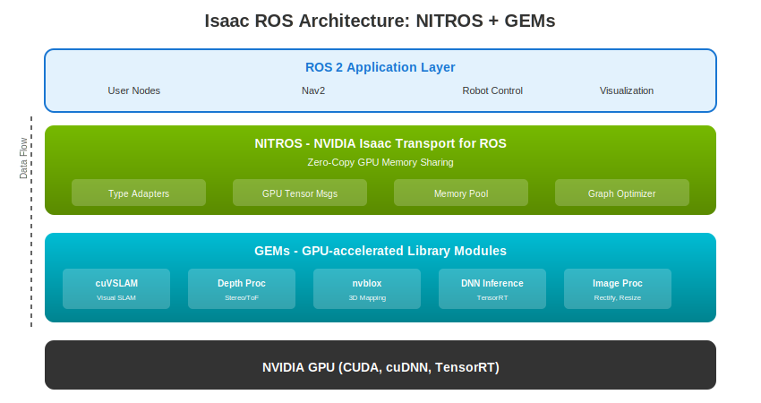
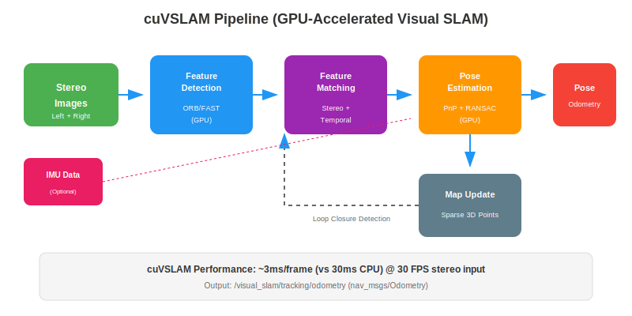
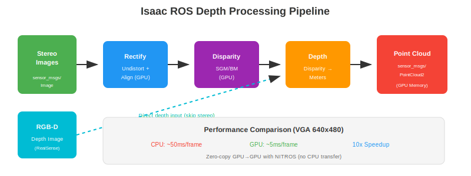
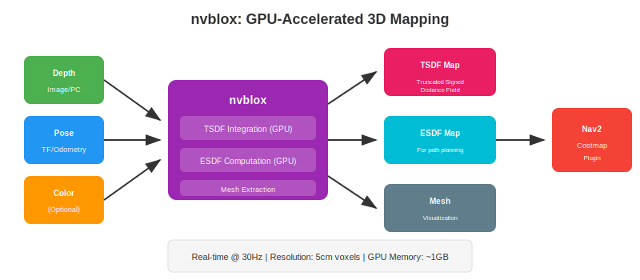

# Chapter 3: Isaac ROS Perception Nodes

**Estimated Time**: 50 minutes reading + 40 minutes exercises

## Learning Objectives

By the end of this chapter, you will be able to:

1. Explain Isaac ROS architecture and its GPU acceleration approach
2. Configure and launch Isaac ROS Visual SLAM
3. Process depth images using Isaac ROS depth nodes
4. Build 3D maps using nvblox
5. Compare Isaac ROS performance to CPU-based alternatives

## Prerequisites

- Completed Chapter 2: Isaac Sim for Synthetic Data
- ROS 2 Humble installed
- Isaac ROS packages installed
- NVIDIA GPU with CUDA support

---

## 3.1 Isaac ROS Architecture

Isaac ROS is NVIDIA's collection of GPU-accelerated ROS 2 packages that dramatically speed up perception tasks.

### Isaac ROS vs Standard ROS Packages

| Feature | Standard ROS | Isaac ROS |
|---------|-------------|-----------|
| Processing | CPU | GPU (CUDA) |
| Memory Transfer | CPU ↔ GPU copies | Zero-copy GPU |
| Latency | 30-100ms | 3-10ms |
| Throughput | 10-30 fps | 60+ fps |
| Power Efficiency | Lower | Higher |

### NITROS: The Secret Sauce



**NITROS** (NVIDIA Isaac Transport for ROS) enables zero-copy GPU memory sharing between nodes:

```
Traditional ROS 2:
Camera → CPU Buffer → GPU → Process → CPU → GPU → Process → CPU → Output
         ↑ copy      ↑ copy           ↑ copy  ↑ copy

NITROS:
Camera → GPU Buffer → Process → Process → Process → Output
         (stays on GPU - no copies!)
```

**Key NITROS features:**
- **Type Adapters**: Automatic conversion between ROS messages and GPU tensors
- **Memory Pool**: Pre-allocated GPU memory for predictable latency
- **Graph Optimizer**: Fuses operations for efficiency

### GEMs: GPU-Accelerated Libraries

Isaac ROS is built on **GEMs** (GPU-accelerated library modules):

| GEM | Function | Speedup |
|-----|----------|---------|
| cuVSLAM | Visual SLAM | ~10x |
| nvblox | 3D mapping | ~6x |
| Depth Proc | Stereo/ToF processing | ~10x |
| DNN Inference | TensorRT inference | ~10x |

---

## 3.2 Installing Isaac ROS

### Docker-Based Installation (Recommended)

Isaac ROS provides pre-built Docker containers:

```bash
# Clone Isaac ROS common
mkdir -p ~/workspaces/isaac_ros-dev/src
cd ~/workspaces/isaac_ros-dev/src
git clone https://github.com/NVIDIA-ISAAC-ROS/isaac_ros_common.git

# Build and run Docker container
cd ~/workspaces/isaac_ros-dev/src/isaac_ros_common
./scripts/run_dev.sh

# Inside container: clone packages you need
cd /workspaces/isaac_ros-dev/src
git clone https://github.com/NVIDIA-ISAAC-ROS/isaac_ros_visual_slam.git
git clone https://github.com/NVIDIA-ISAAC-ROS/isaac_ros_nvblox.git
git clone https://github.com/NVIDIA-ISAAC-ROS/isaac_ros_image_pipeline.git

# Build
cd /workspaces/isaac_ros-dev
colcon build --symlink-install
```

### Native Installation Requirements

If not using Docker:

```bash
# System requirements
- Ubuntu 22.04
- ROS 2 Humble
- NVIDIA Driver 525+
- CUDA 11.8+
- cuDNN 8.6+
- TensorRT 8.5+

# Install dependencies
sudo apt-get install ros-humble-isaac-ros-*
```

### Verifying Installation

```bash
# Check CUDA
nvidia-smi
nvcc --version

# Check Isaac ROS packages
ros2 pkg list | grep isaac

# Expected output:
# isaac_ros_common
# isaac_ros_visual_slam
# isaac_ros_nvblox
# isaac_ros_image_proc
# ...
```

---

## 3.3 Visual SLAM with cuVSLAM

**cuVSLAM** is NVIDIA's GPU-accelerated Visual SLAM implementation.

### What cuVSLAM Provides



**Outputs:**
- Camera pose (position + orientation)
- Visual odometry
- Sparse feature map
- Loop closure detection

**Input requirements:**
- Stereo camera (rectified images)
- Camera calibration (intrinsics + baseline)
- Optional: IMU data for VIO

### Launch File Configuration

```python
# vslam_demo.launch.py
from launch_ros.descriptions import ComposableNode

ComposableNode(
    package='isaac_ros_visual_slam',
    plugin='nvidia::isaac_ros::visual_slam::VisualSlamNode',
    name='visual_slam',
    parameters=[{
        'num_cameras': 2,
        'image_width': 640,
        'image_height': 480,
        'rectified_images': True,
        'map_frame': 'map',
        'odom_frame': 'odom',
        'base_frame': 'base_link',
    }],
    remappings=[
        ('stereo_camera/left/image', '/left/image_rect'),
        ('stereo_camera/right/image', '/right/image_rect'),
    ]
)
```

### Running the VSLAM Demo

```bash
# Terminal 1: Start camera (example with RealSense)
ros2 launch realsense2_camera rs_launch.py enable_infra1:=true enable_infra2:=true

# Terminal 2: Launch VSLAM
ros2 launch isaac_ros vslam_demo.launch.py

# Terminal 3: Visualize in RViz2
rviz2 -d $(ros2 pkg prefix isaac_ros_visual_slam)/share/isaac_ros_visual_slam/rviz/default.rviz
```

### Viewing Output in RViz2

Add these displays:
- **TF**: Shows coordinate frames
- **Odometry**: `/visual_slam/tracking/odometry`
- **Path**: `/visual_slam/tracking/slam_path`
- **PointCloud2**: `/visual_slam/vis/landmarks_cloud`

---

## 3.4 Depth Processing Pipeline

Isaac ROS provides GPU-accelerated depth processing.



### Pipeline Steps

1. **Rectification**: Undistort and align stereo images
2. **Disparity**: Compute pixel displacement between left/right
3. **Depth**: Convert disparity to metric depth
4. **Point Cloud**: Generate 3D points from depth

### isaac_ros_stereo_image_proc

```python
# Disparity computation
ComposableNode(
    package='isaac_ros_stereo_image_proc',
    plugin='nvidia::isaac_ros::stereo_image_proc::DisparityNode',
    name='disparity_node',
    parameters=[{
        'max_disparity': 64.0,
        'backends': 'CUDA',
    }]
)
```

### isaac_ros_depth_image_proc

```python
# Point cloud from depth
ComposableNode(
    package='isaac_ros_depth_image_proc',
    plugin='nvidia::isaac_ros::depth_image_proc::PointCloudXyzrgbNode',
    name='point_cloud_node',
    parameters=[{
        'skip': 1,  # Process every pixel
    }]
)
```

### Performance Comparison

| Stage | CPU (ms) | GPU (ms) | Speedup |
|-------|----------|----------|---------|
| Rectification | 8 | 0.8 | 10x |
| Disparity (SGM) | 35 | 3.5 | 10x |
| Depth conversion | 2 | 0.2 | 10x |
| Point cloud | 10 | 1.0 | 10x |
| **Total** | **55** | **5.5** | **10x** |

---

## 3.5 3D Mapping with nvblox

**nvblox** creates real-time 3D maps using GPU acceleration.



### What nvblox Provides

- **TSDF Map**: Truncated Signed Distance Field for 3D reconstruction
- **ESDF Map**: Euclidean Signed Distance Field for path planning
- **Mesh**: Visualization-ready 3D mesh
- **Costmap**: Nav2-compatible obstacle layer

### nvblox Node Configuration

```python
ComposableNode(
    package='nvblox_ros',
    plugin='nvblox::NvbloxNode',
    name='nvblox_node',
    parameters=[{
        # Map parameters
        'voxel_size': 0.05,  # 5cm resolution
        'esdf': True,
        'esdf_2d': True,     # For Nav2 costmap

        # Integration
        'max_integration_distance_m': 7.0,

        # Output
        'mesh': True,
        'slice_height': 0.5,  # ESDF slice for 2D costmap

        # Frame IDs
        'global_frame': 'map',
    }]
)
```

### Output Topics

| Topic | Type | Description |
|-------|------|-------------|
| `/nvblox_node/mesh` | `nvblox_msgs/Mesh` | 3D mesh visualization |
| `/nvblox_node/static_map` | `sensor_msgs/PointCloud2` | Map point cloud |
| `/nvblox_node/map_slice` | `nvblox_msgs/DistanceMapSlice` | 2D ESDF slice |
| `/nvblox_node/static_occupancy` | `nav_msgs/OccupancyGrid` | For Nav2 |

### Integration with Nav2

nvblox can serve as a costmap layer for Nav2:

```yaml
# nav2_params.yaml
local_costmap:
  plugins: ["nvblox_costmap_layer"]
  nvblox_costmap_layer:
    plugin: "nvblox::NvbloxCostmapLayer"
    enabled: True
    nvblox_map_slice_topic: "/nvblox_node/map_slice"
```

---

## 3.6 Performance Benchmarks

### CPU vs GPU Latency Comparison

```
┌─────────────────────────────────────────────────────────────┐
│            Perception Pipeline Latency (ms)                  │
├────────────────┬────────────┬────────────┬──────────────────┤
│ Component      │ CPU        │ GPU        │ Notes            │
├────────────────┼────────────┼────────────┼──────────────────┤
│ Image Rectify  │ 8.0        │ 0.8        │ 10x faster       │
│ Stereo Depth   │ 45.0       │ 4.5        │ SGM algorithm    │
│ Point Cloud    │ 12.0       │ 1.2        │ 640x480 input    │
│ cuVSLAM        │ 28.0       │ 2.8        │ Stereo input     │
│ nvblox Update  │ 45.0       │ 8.0        │ 5cm voxels       │
├────────────────┼────────────┼────────────┼──────────────────┤
│ TOTAL          │ 138.0      │ 17.3       │ 8x overall       │
└────────────────┴────────────┴────────────┴──────────────────┘
```

### Throughput Measurements

| Pipeline | CPU (fps) | GPU (fps) | Speedup |
|----------|-----------|-----------|---------|
| Depth Only | 20 | 90+ | 4.5x |
| VSLAM | 15 | 60+ | 4x |
| Full Pipeline | 7 | 30+ | 4x |

### Resource Utilization

| Resource | Isaac ROS | CPU-only |
|----------|-----------|----------|
| GPU Utilization | 40-60% | 0% |
| CPU Utilization | 10-20% | 80-100% |
| Memory (GPU) | 1-2 GB | 0 |
| Memory (CPU) | 500 MB | 2-4 GB |
| Power (Jetson) | 15W | 25W |

### When GPU Acceleration Matters

**Essential for:**
- Real-time VSLAM (>30 fps requirement)
- Dense depth processing
- 3D mapping at high resolution
- Multiple simultaneous perception tasks
- Edge deployment (Jetson)

**Not necessary for:**
- Offline processing
- Low-resolution input (&lt;320x240)
- Simple 2D LiDAR SLAM
- Single-task pipelines with relaxed timing

---

## 3.7 Debugging Isaac ROS

### Common Error Messages

| Error | Cause | Solution |
|-------|-------|----------|
| `CUDA out of memory` | GPU VRAM exhausted | Reduce resolution, voxel size |
| `Transform timeout` | Missing TF | Check TF tree, add static transforms |
| `No data on topic` | Topic mismatch | Verify remappings |
| `NITROS type mismatch` | Wrong message type | Use compatible NITROS types |

### Node Introspection

```bash
# List Isaac ROS topics
ros2 topic list | grep -E "(visual_slam|nvblox|depth)"

# Check topic rate
ros2 topic hz /visual_slam/tracking/odometry

# Echo messages
ros2 topic echo /visual_slam/tracking/odometry --once

# View node parameters
ros2 param list /visual_slam
ros2 param get /visual_slam image_width
```

### Performance Profiling

```bash
# Enable NVIDIA profiler
nsys profile ros2 launch isaac_ros perception_pipeline.launch.py

# View GPU utilization
watch -n 0.5 nvidia-smi

# ROS 2 tracing
ros2 run tracetools_trace trace -s my_trace -k
```

### Memory Usage Monitoring

```bash
# GPU memory
nvidia-smi --query-gpu=memory.used,memory.free --format=csv -l 1

# CPU memory for specific node
ps aux | grep visual_slam
```

---

## Exercises

### Exercise 3.1: VSLAM Demo (20 min)

**Objective**: Run Isaac ROS Visual SLAM

**Task**: Launch VSLAM with simulated stereo camera data and observe pose tracking in RViz2

**Steps**:
1. Start Isaac Sim with stereo camera publishing
2. Launch the VSLAM demo
3. Move the camera in simulation
4. Observe pose updates in RViz2

**Success Criteria**:
- [ ] VSLAM node starts without errors
- [ ] Camera pose updates in real-time
- [ ] Path visualization shows camera trajectory
- [ ] Landmarks visible in point cloud

### Exercise 3.2: Depth Processing (20 min)

**Objective**: Process depth images with GPU acceleration

**Task**: Run depth processing pipeline and generate point clouds

**Steps**:
1. Stream stereo or RGB-D camera data
2. Launch depth processing nodes
3. Visualize disparity and point cloud in RViz2
4. Verify FPS > 30

**Success Criteria**:
- [ ] Disparity image visible
- [ ] Point cloud renders in RViz2
- [ ] Frame rate > 30 fps
- [ ] Latency < 10ms

### Exercise 3.3: Performance Comparison (30 min)

**Objective**: Quantify GPU acceleration benefits

**Task**: Run depth processing with GPU and compare metrics

**Steps**:
1. Launch GPU-accelerated pipeline
2. Measure latency with `ros2 topic delay`
3. Measure throughput with `ros2 topic hz`
4. Record GPU utilization with `nvidia-smi`

**Metrics to record**:
- [ ] Latency (ms): ___
- [ ] Throughput (fps): ___
- [ ] GPU utilization (%): ___
- [ ] CPU utilization (%): ___

**Success Criteria**:
- [ ] Documented at least 3 performance metrics
- [ ] Compared to expected values from this chapter

---

## Assessment Questions

### Multiple Choice

**1.** What does NITROS provide in Isaac ROS?

- A) Network communication
- B) Zero-copy GPU memory sharing
- C) ROS message serialization
- D) Docker containerization

<details>
<summary>Answer</summary>
**B) Zero-copy GPU memory sharing** - NITROS enables data to stay on GPU memory between nodes, eliminating costly CPU↔GPU copies.
</details>

**2.** Which Isaac ROS package provides 3D reconstruction and occupancy mapping?

- A) isaac_ros_visual_slam
- B) isaac_ros_depth_image_proc
- C) isaac_ros_nvblox
- D) isaac_ros_image_pipeline

<details>
<summary>Answer</summary>
**C) isaac_ros_nvblox** - nvblox creates TSDF/ESDF maps and can generate costmaps for Nav2.
</details>

### Short Answer

**3.** Explain why Visual SLAM is computationally demanding and how cuVSLAM addresses this.

<details>
<summary>Answer</summary>
Visual SLAM is demanding because it must:
- Detect features in every frame (1000s of keypoints)
- Match features between stereo images and across time
- Estimate 6-DOF pose from matches
- Update sparse map representation
- Detect loop closures

cuVSLAM addresses this by:
- Running feature detection on GPU (parallel processing of 1000s of pixels)
- GPU-accelerated feature matching with CUDA
- Parallel pose estimation algorithms
- Using NITROS for zero-copy memory (no CPU↔GPU bottleneck)

Result: ~10x speedup (28ms → 2.8ms per frame)
</details>

**4.** List three scenarios where GPU-accelerated perception is essential vs three where CPU is sufficient.

<details>
<summary>Answer</summary>
**GPU Essential:**
1. Real-time VSLAM at 30+ fps (autonomous navigation)
2. Dense 3D reconstruction while moving (nvblox at 5cm resolution)
3. Multi-sensor fusion with tight timing requirements
4. Edge deployment on Jetson with power constraints
5. High-resolution camera input (1080p or higher)

**CPU Sufficient:**
1. Offline map building (no real-time requirement)
2. 2D LiDAR SLAM (simpler algorithm, less data)
3. Low-rate localization (1-5 Hz update rate)
4. Low-resolution cameras (&lt;320x240)
5. Simple depth processing for slow-moving robots
</details>

### Practical

**5.** Given a stereo camera publishing on `/left/image_raw` and `/right/image_raw`, what launch file changes are needed to run cuVSLAM?

<details>
<summary>Answer</summary>
```python
# Key remappings needed:
remappings=[
    ('stereo_camera/left/image', '/left/image_raw'),
    ('stereo_camera/left/camera_info', '/left/camera_info'),
    ('stereo_camera/right/image', '/right/image_raw'),
    ('stereo_camera/right/camera_info', '/right/camera_info'),
]

# If images aren't rectified, add rectification nodes first:
# 1. isaac_ros_image_proc::RectifyNode for left
# 2. isaac_ros_image_proc::RectifyNode for right

# Parameter changes:
parameters=[{
    'rectified_images': False,  # If using raw images
    # OR
    'rectified_images': True,   # If adding rectify nodes
}]
```
</details>

---

## Summary

In this chapter, you learned:

- **Isaac ROS** provides GPU-accelerated perception for ROS 2
- **NITROS** enables zero-copy GPU memory sharing between nodes
- **cuVSLAM** achieves ~10x speedup for Visual SLAM
- **nvblox** creates real-time 3D maps with TSDF/ESDF
- GPU acceleration is **essential** for real-time perception
- Proper **debugging** requires understanding CUDA, TF, and ROS 2 introspection

---

## References

1. NVIDIA. (2024). *Isaac ROS Documentation*. https://nvidia-isaac-ros.github.io/
2. NVIDIA. (2024). *cuVSLAM Technical Documentation*. https://nvidia-isaac-ros.github.io/concepts/visual_slam/
3. NVIDIA. (2024). *nvblox Documentation*. https://nvidia-isaac-ros.github.io/repositories_and_packages/isaac_ros_nvblox/
4. Oleynikova, H., et al. (2017). "Voxblox: Incremental 3D Euclidean Signed Distance Fields for On-Board MAV Planning." *IEEE/RSJ International Conference on Intelligent Robots and Systems (IROS)*.

---

**Next**: [Chapter 4: Nav2 for Humanoid Navigation](./chapter-04-nav2) →
