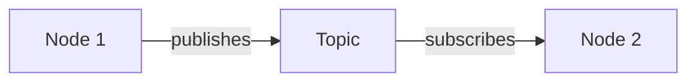

# Quickstart: Module 1 Development

**Purpose**: Get the development environment running to work on Module 1 content.

## Prerequisites

- Node.js 18+ installed
- Git installed
- (For testing code examples) ROS 2 Humble on Ubuntu 22.04

## Quick Setup

### 1. Clone and Install

```bash
# Clone the repository
git clone <repository-url>
cd book1

# Install dependencies
cd book
npm install
```

### 2. Start Development Server

```bash
# Start Docusaurus dev server
npm run start
```

The site will be available at `http://localhost:3000`.

### 3. Build for Production

```bash
# Build static site
npm run build

# Preview the build
npm run serve
```

## Working on Module 1 Content

### File Locations

| Content | Location |
|---------|----------|
| Module overview | `book/docs/module-01-ros2/index.md` |
| Chapter 1 | `book/docs/module-01-ros2/chapter-01-basics.mdx` |
| Chapter 2 | `book/docs/module-01-ros2/chapter-02-rclpy-control.mdx` |
| Chapter 3 | `book/docs/module-01-ros2/chapter-03-urdf-humanoids.mdx` |
| Images/diagrams | `book/docs/module-01-ros2/assets/diagrams/` |
| Code examples | `book/docs/module-01-ros2/assets/code/` |
| URDF files | `book/static/urdf/` |

### Creating a New Chapter

1. Create the MDX file:
```bash
touch book/docs/module-01-ros2/chapter-XX-name.mdx
```

2. Add frontmatter:
```mdx
---
sidebar_position: X
title: "Chapter X: Title"
description: "Brief description for SEO"
---

# Chapter X: Title

## Learning Objectives

By the end of this chapter, you will be able to:

1. First objective
2. Second objective
```

3. Update sidebar if needed (auto-generated from folder structure).

### Adding Code Examples

Use the Tabs component for code with run instructions:

```mdx
import Tabs from '@theme/Tabs';
import TabItem from '@theme/TabItem';

<Tabs>
  <TabItem value="code" label="Code" default>

```python title="example.py"
# Your code here
```

  </TabItem>
  <TabItem value="run" label="How to Run">

```bash
python3 example.py
```

  </TabItem>
</Tabs>
```

### Adding Diagrams

**Mermaid (preferred for flowcharts)**:
```mdx

```

**Images**:
```mdx

```

### Adding Admonitions

```mdx
:::note
This is a note.
:::

:::tip
This is a tip.
:::

:::warning
This is a warning.
:::

:::danger
This is dangerous.
:::
```

## Validation Commands

### Check Docusaurus Build

```bash
cd book
npm run build
```

Must complete without errors.

### Lint Markdown

```bash
npx markdownlint "docs/**/*.md" "docs/**/*.mdx"
```

### Check Links

```bash
npx linkinator ./build --recurse
```

### Validate URDF Files

```bash
# Requires ROS 2 environment
source /opt/ros/humble/setup.bash
check_urdf static/urdf/humanoid_simple.urdf
```

### Test Code Examples

```bash
# In ROS 2 environment
cd examples/ros2_ws
colcon build
source install/setup.bash
ros2 run humanoid_basics publisher_node
```

## Writing Workflow

### Draft Phase
1. Write content in MDX
2. Use `[REF: topic]` for citations to add later
3. Use `[TODO: description]` for incomplete sections
4. Run `npm run start` to preview

### Build Phase
1. Run `npm run build`
2. Fix any MDX syntax errors
3. Verify all imports resolve

### Test Phase
1. Test all code examples in ROS 2
2. Validate URDF with `check_urdf`
3. Check all links work
4. Verify images render

### Refine Phase
1. Replace `[REF: topic]` with IEEE citations
2. Add diagrams (Mermaid or images)
3. Complete exercises with solutions
4. Add assessment questions

### Publish Phase
1. Create PR to main branch
2. Pass CI checks
3. Merge to deploy

## Common Issues

### MDX Syntax Errors

**Problem**: Build fails with "unexpected token"
**Solution**: Check for:
- Unclosed JSX tags
- Missing imports for components
- Invalid Markdown inside JSX

### Images Not Loading

**Problem**: Images show broken icon
**Solution**:
- Use relative paths from the MDX file
- Place images in `assets/` folder next to MDX
- Or use `/` for paths from `static/`

### Code Block Highlighting

**Problem**: Code not highlighted correctly
**Solution**: Add language after backticks:
```
```python
code here
```
```

### Hot Reload Not Working

**Problem**: Changes not appearing
**Solution**:
- Check for syntax errors (they stop HMR)
- Restart dev server: `npm run start`

## Useful Resources

- [Docusaurus Docs](https://docusaurus.io/docs)
- [MDX Documentation](https://mdxjs.com/)
- [ROS 2 Humble Docs](https://docs.ros.org/en/humble/)
- [URDF Tutorial](https://wiki.ros.org/urdf/Tutorials)
